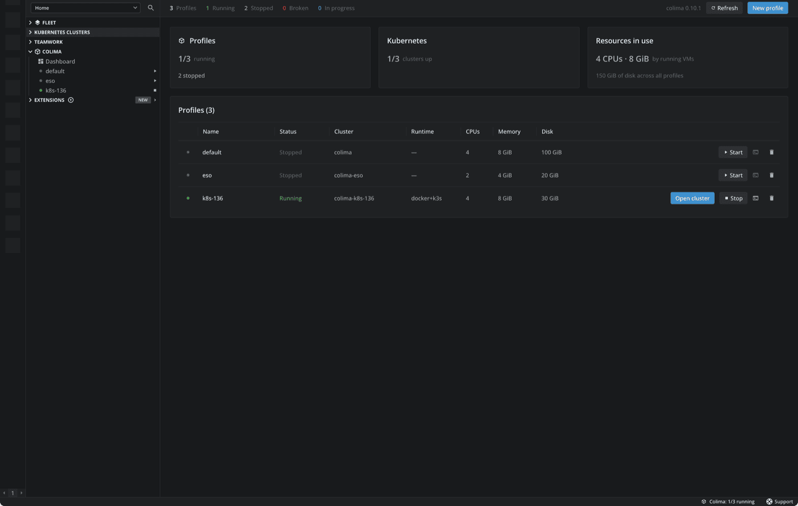
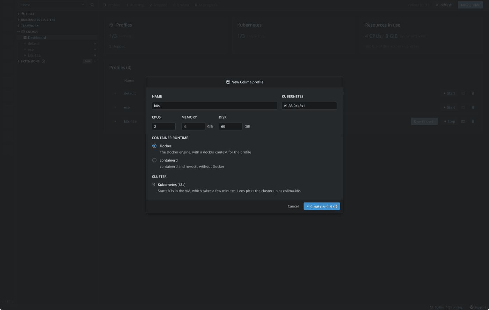

# Colima for Lens

**Your local Kubernetes clusters, one click from running.**

Stop dropping into a terminal to type `colima start`. Colima for Lens puts every [Colima](https://github.com/abiosoft/colima) profile on your machine right inside Lens: start it, watch it boot, and step straight into its cluster without typing a single command.



## Why you'll want it

- **From stopped to inside the cluster in one click.** Press **Start**, follow Colima's progress on the row, and the moment k3s is up Lens offers to open the cluster. No context juggling, no waiting at a prompt.
- **Everything at a glance.** Which profiles run, which clusters are up, and how many CPUs and GiB your VMs are holding on to, on one dashboard.
- **A fresh cluster from a form, not a list of flags.** Name it, size it, pick the runtime and the Kubernetes version, prefilled with the one Colima defaults to, and press **Create and start**.
- **Right where you already are.** Right-click a Colima cluster in Lens's cluster list and start or stop its VM in place.
- **Feels like part of Lens.** Built from Lens's own components: it follows your theme, lives in the navigator, and answers to the command palette.

## From zero to cluster

1. Open **Colima** near the bottom of the navigator, and click **Dashboard**.
2. Press **New profile**, keep the defaults or tune them, and press **Create and start**.
3. Watch Colima work on the profile's row. When it is up, press **Open cluster**.



Already have profiles? They are there the moment you install: nothing to import, nothing to configure.

## Everything it does

- **Colima in the navigator.** A *Colima* item holds a *Dashboard* and every profile on your machine, with whether it is running. Hover a profile for Start or Stop, click a running one to open its cluster, or right-click it to start, stop, open a shell in its VM or delete it.
- **The dashboard.** Every profile, running or not, with its status, cluster, runtime, CPUs, memory and disk, and Start, Stop, Open cluster, Shell and Delete buttons. Above them, how many profiles run, how many clusters are up, and what the running VMs take. While a profile starts, its row shows what Colima is doing.
- **Start and stop from the cluster itself.** Right-click a cluster Colima made (`colima`, `colima-<profile>`) and pick **Start Colima VM** or **Stop Colima VM**.
- **New profiles.** CPUs, memory, disk, Docker or containerd, and Kubernetes on or off, with the version of your choice.
- **A shell in the VM.** **Shell** opens a Lens terminal inside the profile's virtual machine.
- **Status bar.** The bottom right shows how many profiles run, and what is starting or stopping.
- **Command palette.** *Colima: Manage profiles* and *Colima: Create a Kubernetes cluster*.

## Requirements

Colima runs on macOS and Linux, and must be installed there, for example with Homebrew:

```sh
brew install colima
```

The extension finds `colima` on your `PATH`, and where Homebrew installs it: `/opt/homebrew/bin`, `/usr/local/bin` and `/home/linuxbrew/.linuxbrew/bin`. If it cannot find it, the dashboard says so and links to the installation guide. Colima does not run on Windows, so there the extension shows nothing.

## Good to know

- Starting a profile does exactly what `colima start --profile <name>` does in a terminal, including making its Docker and Kubernetes contexts the current ones.
- Lens finds a new profile's cluster in your kubeconfig, where Colima writes it as `colima` for the default profile and `colima-<profile>` for the others.
- Deleting a profile asks first and removes its VM; tick *Also delete container data* to remove its images and volumes too.

What changed in each version is in [CHANGELOG.md](./CHANGELOG.md).
